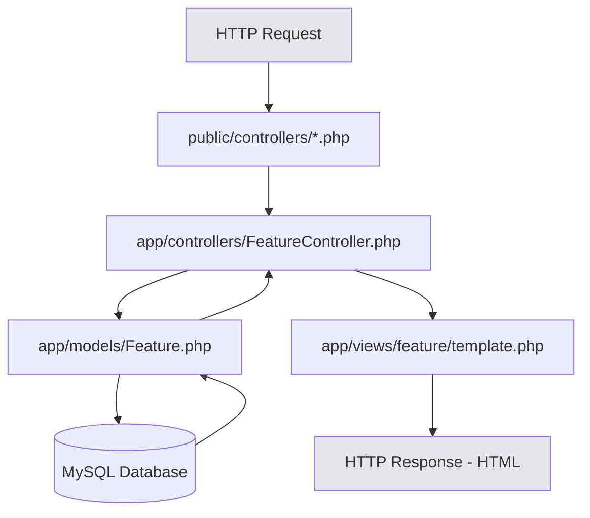
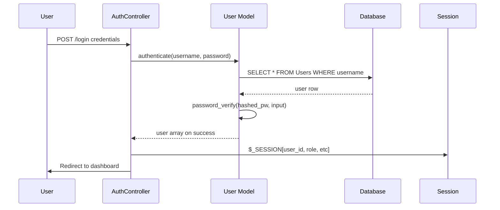
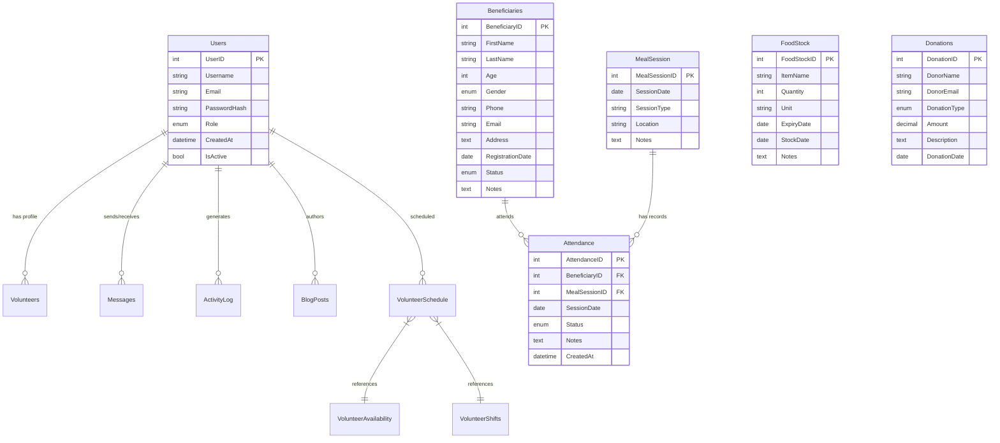
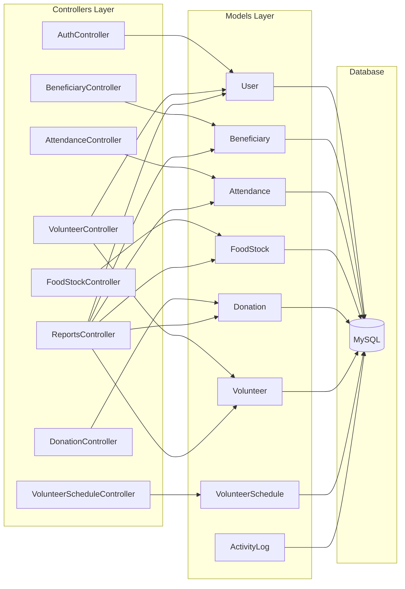
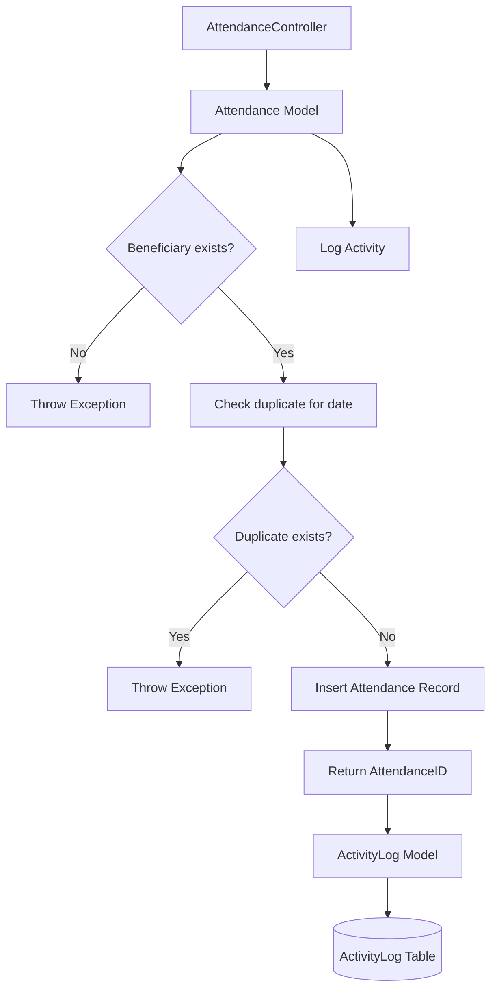

# CODEBASE KNOWLEDGE - Feeding Scheme Management System (FSMS)

**Generated:** 2026-06-08  
**Repository:** Tharimpepe Feeding Scheme Management System  
**Purpose:** This document serves as a complete "brain dump" for understanding the FSMS codebase without requiring access to the full repository.

---

## 1. HIGH-LEVEL OVERVIEW

### 1.1 Application Purpose & Domain

The Feeding Scheme Management System (FSMS) is a web-based application designed to manage meal distribution operations for the Tharimpepe Feeding Scheme, a community feeding program. The system tracks beneficiaries receiving meals, manages volunteers who distribute food, and maintains inventory of donated food supplies.

### 1.2 Core Business Features

| Feature | Business Purpose | Primary Entities |
|---------|-----------------|------------------|
| **Beneficiary Management** | Register and track individuals/families receiving meals | Beneficiaries, Attendance |
| **Attendance Tracking** | Record daily meal distribution to beneficiaries | Attendance, MealSession |
| **Food Stock Management** | Track inventory of donated food items | FoodStock |
| **Donation Management** | Record and track food/cash donations from donors | Donations |
| **Volunteer Management** | Register, schedule, and track volunteer workers | Volunteers, VolunteerSchedule, Users |
| **Reports & Dashboard** | Provide operational insights and analytics | All entities via Reports model |
| **User Authentication** | Secure access control for staff/admin roles | Users, SessionHandler |

### 1.3 Tech Stack

```
Backend: PHP 7.4+, PDO, MySQL/MariaDB
Frontend: PHP Views, HTML, Bootstrap 5.3, Font Awesome, Custom CSS
Architecture: MVC-style (separation of concerns)
Security: password_hash (bcrypt), CSRF tokens, Session-based auth
Testing: Lightweight PHP test runner in tests/
```

---

## 2. SYSTEM ARCHITECTURE

### 2.1 Directory Structure

```
fsms/
├── public/                        # Document root (entry point)
│   ├── index.php                  # Main entry point - routes to login/dashboard
│   ├── controllers/               # Thin wrappers (proxy to app/controllers)
│   │   ├── AuthController.php
│   │   ├── BeneficiaryController.php
│   │   ├── AttendanceController.php
│   │   ├── FoodStockController.php
│   │   ├── DonationController.php
│   │   ├── VolunteerController.php
│   │   └── VolunteerScheduleController.php
│   ├── assets/                    # Static assets (images, icons)
│   ├── sw.js                      # Service worker for PWA
│   ├── manifest.json              # PWA manifest
│   └── router.php                 # URL routing (basic fallback)
│
├── app/                           # Application core
│   ├── controllers/               # Main workflow controllers
│   │   ├── AuthController.php     # Login, register, logout
│   │   ├── BeneficiaryController.php
│   │   ├── AttendanceController.php
│   │   ├── FoodStockController.php
│   │   ├── DonationController.php
│   │   ├── VolunteerController.php
│   │   ├── VolunteerScheduleController.php
│   │   ├── ReportsController.php
│   │   └── DashboardController.php
│   │
│   ├── models/                    # Data layer (PDO operations)
│   │   ├── User.php               # Authentication, user CRUD
│   │   ├── Beneficiary.php        # Beneficiary CRUD, search
│   │   ├── Attendance.php         # Attendance tracking, stats
│   │   ├── FoodStock.php          # Inventory management
│   │   ├── Donation.php           # Donation tracking
│   │   ├── Volunteer.php          # Volunteer profiles
│   │   ├── VolunteerSchedule.php  # Scheduling (static methods)
│   │   ├── Reports.php            # Cross-module reporting
│   │   ├── ActivityLog.php        # Audit trail logging
│   │   └── MealSession.php        # Meal session management
│   │
│   ├── views/                     # PHP templates (HTML generation)
│   │   ├── dashboard.php          # Main dashboard (KPI overview)
│   │   ├── login.php              # Login form
│   │   ├── includes/              # Shared components (navbar, footer)
│   │   ├── beneficiaries/         # Beneficiary views
│   │   ├── attendance/            # Attendance views
│   │   ├── food_stock/            # Stock views
│   │   ├── donations/             # Donation views
│   │   ├── volunteers/            # Volunteer views
│   │   ├── schedules/             # Schedule views
│   │   ├── reports/               # Report views
│   │   └── users/                 # User management views
│   │
│   └── helpers/                   # Shared utilities
│       ├── bootstrap.php          # App initialization (constants, error handling)
│       ├── SessionHandler.php     # Auth middleware functions
│       ├── ErrorHandler.php       # Global error/exception handling
│       ├── FormValidator.php      # Input validation utilities
│       └── Exceptions.php         # Custom exception classes
│
├── config/
│   └── database.php               # PDO connection class
│
├── sql/
│   └── schema.sql                 # Database schema
│
├── tests/
│   ├── run_all_tests.php          # Test runner
│   ├── TestCase.php               # Base test class
│   └── TestAuthenticationAndValidation.php
│
├── docs/
│   ├── academic/                  # Requirements & design documents
│   ├── screenshots/               # Figma prototype screenshots
│   ├── proposals/                 # Handoff documentation
│   └── diagrams/                  # Architecture diagrams
│
├── tools/                         # Setup scripts
└── database/                      # Future migrations/seeds
```

### 2.2 Request Flow (MVC Pattern)



### 2.3 Authentication & Authorization Flow



---

## 3. DATABASE SCHEMA

### 3.1 Entity Relationship Diagram



### 3.2 Key Tables

| Table | Purpose | Important Fields |
|-------|---------|----------------|
| `Users` | Authentication and role management | UserID (PK), Username, Email, PasswordHash, Role (admin/volunteer/donor/staff), IsActive |
| `Beneficiaries` | Meal recipients | BeneficiaryID, FirstName, LastName, Age, Gender, Phone, Address, RegistrationDate, Status |
| `Attendance` | Daily meal attendance | AttendanceID, BeneficiaryID, MealSessionID, SessionDate, Status (present/absent/marked) |
| `FoodStock` | Inventory items | FoodStockID, ItemName, Quantity, Unit, ExpiryDate, StockDate |
| `Donations` | Donation records | DonationID, DonorName, DonationType (cash/food/supplies/other), Amount, DonationDate |
| `Volunteers` | Volunteer profiles (linked to Users) | VolunteerID, UserID (FK), FirstName, LastName, Phone, AvailabilityStatus |
| `VolunteerSchedule` | Scheduled shifts | ScheduleID, VolunteerID, ScheduleDate, StartTime, EndTime, Status |
| `Messages` | Internal messaging | MessageID, SenderID, RecipientID, Subject, Content, IsRead |
| `BlogPosts` | Community announcements | BlogPostID, Title, Content, AuthorID, PublishDate |
| `Gallery` | Media/images | GalleryID, ImagePath, Title, UploadedBy |
| `ActivityLog` | Audit trail | ActivityID, UserID, Action, AffectedEntityName, AffectedEntityID, Details |

---

## 4. FEATURE-BY-FEATURE ANALYSIS

### 4.1 Authentication

**Entry Point:** `public/controllers/AuthController.php` (routes to `app/controllers/AuthController.php`)

**Core Logic:** `app/models/User.php`

| Method | Purpose | Validation |
|--------|---------|------------|
| `authenticate($username, $password)` | Validate credentials | Uses `password_verify()` against bcrypt hash |
| `register($username, $email, $password, $role)` | Create new user | Checks duplicates, validates email, hashes password |
| `findByUsername($username)` | Find user by username | Parameterized query |
| `changePassword($userId, $newPassword)` | Update password | Minimum 6 chars, bcrypt hash |

**Demo Mode:** Falls back to `.demo_users.json` file if database unavailable - enables testing without MySQL.

**Error Handling:** Custom exceptions (`DatabaseException`, `ValidationException`, `AuthenticationException`) in `app/helpers/Exceptions.php`.

### 4.2 Beneficiary Management

**Controller:** `app/controllers/BeneficiaryController.php`

**Model:** `app/models/Beneficiary.php`

**Views:** `app/views/beneficiaries/` (list.php, create.php, edit.php, view.php)

| Action | URL Pattern | Purpose |
|--------|-------------|---------|
| `list` | `?action=list` | Paginated list with status filtering |
| `create` | `?action=create` | Show/create form |
| `edit` | `?action=edit&id=X` | Edit existing beneficiary |
| `view` | `?action=view&id=X` | View beneficiary profile |
| `search` | `?action=search&q=term` | Search by name/notes |
| `delete` | `?action=delete&id=X` | Hard delete beneficiary |
| `update-status` | `?action=update-status` (POST) | AJAX status update |

**Business Rules:**
- Beneficiary status: `active`, `inactive`, `suspended`
- Age range validation: 0-120 years
- Gender: `Male`, `Female`, `Other`
- Email format validation (optional)

### 4.3 Attendance Tracking

**Controller:** `app/controllers/AttendanceController.php`

**Model:** `app/models/Attendance.php`

**Views:** `app/views/attendance/`

| Action | Purpose |
|---------|---------|
| `list` | All attendance records with filters |
| `create` | Record new attendance (single) |
| `bulk-record` | Record attendance for multiple beneficiaries |
| `daily-summary` | Summary view for a specific date |
| `report` | Date-range attendance report |
| `bulk_save` | AJAX endpoint for dashboard recording |

**Key Features:**
- Attendance statuses: `present`, `absent`, `marked`
- Prevents duplicate attendance per beneficiary per date
- Bulk recording with transaction safety
- Daily summary shows all active beneficiaries with attendance status

### 4.4 Food Stock Management

**Controller:** `app/controllers/FoodStockController.php`

**Model:** `app/models/FoodStock.php`

**Views:** `app/views/food_stock/`

| Action | Purpose | Authorization |
|--------|---------|---------------|
| `list` | Paginated stock list | Any logged-in user |
| `create` | Add new stock item | Any logged-in user |
| `view` | View item details | Any logged-in user |
| `edit` | Edit item | Any logged-in user |
| `delete` | Delete item | Admin only |
| `distribute` | Reduce quantity for distribution | Any logged-in user |
| `low-stock` | Items with quantity ≤ 5 | Any logged-in user |
| `expired` | Expired items | Any logged-in user |
| `report` | Stock statistics | Any logged-in user |

**Low Stock Threshold:** 5 units (configurable in model)

**Expiry Logic:**
- `expired`: ExpiryDate < today
- `expiring_soon`: ExpiryDate within 7 days
- `ok`: Everything else

### 4.5 Donation Management

**Controller:** `app/controllers/DonationController.php`

**Model:** `app/models/Donation.php`

**Views:** `app/views/donations/`

**Donation Types:** `cash`, `food`, `supplies`, `other`

| Action | Purpose | Authorization |
|--------|---------|---------------|
| `list` | Paginated donations | Any logged-in user |
| `create` | Record new donation | Any logged-in user |
| `view` | View donation details | Any logged-in user |
| `edit` | Edit donation | Any logged-in user |
| `delete` | Delete donation | Admin only |
| `top-donors` | List top donors by amount | Any logged-in user |
| `report` | Donation analytics | Any logged-in user |

### 4.6 Volunteer Management

**Controller:** `app/controllers/VolunteerController.php`

**Model:** `app/models/Volunteer.php`

**VolunteerSchedule Model:** `app/models/VolunteerSchedule.php` (static methods)

| Action | Purpose |
|--------|---------|
| `list` | Volunteer list with availability filter |
| `create` | Create volunteer (creates User + Volunteer profile) |
| `view` | View volunteer details |
| `edit` | Edit volunteer profile |
| `search` | Search by name/phone |
| `delete` | Soft delete (deactivates User) |
| `update-status` | AJAX availability status update |

**Availability Status:** `available`, `unavailable`, `on_leave`

### 4.7 Reports

**Controller:** `app/controllers/ReportsController.php`

**Model:** `app/models/Reports.php`

**Views:** `app/views/reports/`

| Report Type | Purpose |
|-------------|---------|
| `attendance` | Attendance records with beneficiary details |
| `donation` | Donation summary and top donors |
| `food_stock` | Current inventory status |
| `food_distribution` | Items distributed over time |
| `volunteer_performance` | Volunteer hours and shift completion |
| `program_summary` | Combined metrics across all modules |
| `financial_summary` | Monthly financial summary |

---

## 5. CROSS-CUTTING CONCERNS

### 5.1 Authentication & Authorization

**SessionHandler.php** provides:
- `isUserLoggedIn()` - Check session for user_id
- `requireLogin()` - Redirect to login if not authenticated
- `getCurrentUser()` - Returns array with user_id, username, email, role
- `hasRole($role)` - Check user role
- `logoutUser()` - Destroy session

**RBAC Rules (from controllers):**
- Admin: Full access (including delete operations)
- Staff: Full access to beneficiary, attendance, stock, donations, volunteers
- Volunteer/Donor: Limited/landing page access

**Session-based auth** with `$_SESSION` superglobal storing:
- `user_id`, `username`, `email`, `role`, `login_time`, `csrf_token`

### 5.2 CSRF Protection

Implemented in `bootstrap.php`:
```php
generateCSRFToken()     // Creates token in session if not exists
verifyCSRFToken($token) // Uses hash_equals() for timing-safe comparison
csrfTokenInput()        // Returns hidden input field for forms
```

All forms must include: `<?= csrfTokenInput() ?>`

### 5.3 Error Handling

**ErrorHandler.php** (`app/helpers/ErrorHandler.php`):
- Converts PHP errors to `ErrorException`
- Handles uncaught exceptions with try/catch
- Detects CLI vs web context
- Detects JSON API requests
- Development mode shows debug info (when `DEBUG_MODE=true`)

**Exception classes:**
- `DatabaseException` - Database connection/query failures
- `ValidationException` - Form input validation failures
- `AuthenticationException` - Login/registration failures
- `DuplicateException` - Unique constraint violations

### 5.4 Input Validation

**FormValidator.php** (`app/helpers/FormValidator.php`):
- `validateEmail()` - RFC-compliant email validation
- `validateUsername()` - 3-50 chars, alphanumeric + underscore
- `validatePassword()` - Minimum length check
- `validatePhone()` - Optional, numeric characters only
- `validateDate()` - YYYY-MM-DD format validation
- `sanitizeString()` - strip_tags + htmlspecialchars
- Static error collection via `$errors` array

---

## 6. THINGS TO KNOW BEFORE CHANGING CODE

### 6.1 Critical Business Rules

| Rule | Location | Impact |
|------|----------|--------|
| Beneficiary age 0-120 validation | `app/models/Beneficiary.php:93-95` | Data integrity |
| Attendance uniqueness per date | `app/models/Attendance.php:135-137` | Prevents double-counting meals |
| Stock quantity cannot go negative | `app/models/FoodStock.php:310-314` | Inventory accuracy |
| Volunteer soft-delete via User deactivation | `app/models/Volunteer.php:302-316` | Audit trail retention |
| CSRF token required on POST | `app/helpers/bootstrap.php:257-276` | Security |

### 6.2 High-Risk Hotspots

1. **VolunteerSchedule.php** - Contains duplicate class definition (lines 12-299 and 300-602). This causes PHP fatal errors and must be fixed.

2. **Database connection fallback** - `Database.php` tries multiple database names; may cause confusion in development.

3. **Hardcoded demo data in dashboard** - `dashboard.php` (lines 382-422) uses static arrays instead of live data.

4. **Missing ActivityLog table** - The schema doesn't define `ActivityLog` table but `ActivityLog.php` model tries to insert into it.

### 6.3 Non-Obvious Design Decisions

- **Demo mode** in `User.php` allows authentication without MySQL for development/testing
- **Two schema patterns in VolunteerSchedule** - One uses `VolunteerSchedules` table, another uses `VolunteerSchedule` (singular). The schema.sql doesn't clearly match either.
- **MealSession is optional** in Attendance - Can record attendance without linking to a meal session
- **Bootstrap included in views** - Each view independently includes bootstrap.php for error handling

### 6.4 Performance Considerations

- Pagination implemented on all list views (limit/offset)
- Indexes on `Attendance(BeneficiaryID)`, `Attendance(SessionDate)`
- No explicit connection pooling (single PDO connection)
- No caching layer implemented

### 6.5 Security Implications

- Password hashing uses `PASSWORD_BCRYPT` (strong)
- All database queries use prepared statements (SQL injection protected)
- XSS prevention via `htmlspecialchars()` on output
- CSRF tokens on all forms
- Session cookies use default PHP settings (not hardened)

---

## 7. TECHNICAL REFERENCE

### 7.1 Key Functions & Classes

| Component | Method | Signature | Purpose |
|-----------|--------|-----------|---------|
| `Database` | `connect()` | `-> connect(): PDO` | Establishes PDO connection |
| `Database` | `getConnection()` | `-> getConnection(): PDO` | Alias for connect() |
| `User` | `authenticate()` | `(username, password): array|false` | Verify credentials |
| `User` | `register()` | `(username, email, password, role): int|false` | Create account |
| `Beneficiary` | `createBeneficiary()` | `(firstName, lastName, age, gender, phone, email, address, registrationDate, notes): int|false` | New beneficiary |
| `Attendance` | `recordAttendance()` | `(beneficiaryId, sessionDate, status, notes, mealSessionId): int|false` | Mark attendance |
| `Attendance` | `bulkRecordAttendance()` | `(sessionDate, attendanceData): array` | Multiple records, transaction |
| `FoodStock` | `createStock()` | `(data): ['success'=>bool, 'message'=>string, ...]` | New inventory item |
| `FoodStock` | `updateQuantity()` | `(id, quantity, operation): ['success'=>bool, 'new_quantity'=>int]` | Distribute or add stock |
| `Donation` | `createDonation()` | `(data): ['success'=>bool, 'id'=>int]` | Record donation |
| `Volunteer` | `createVolunteer()` | `(userId, firstName, lastName, phone, address): int|false` | New volunteer profile |
| `VolunteerSchedule` | Static methods | Various signatures | Shift scheduling |
| `ActivityLog` | Static methods | Various signatures | Audit logging |
| `FormValidator` | Static methods | Various signatures | Input validation |

### 7.2 Configuration Constants

Defined in `bootstrap.php`:
- `APP_ROOT` - `dirname(__DIR__, 2)` - Repository root
- `APP_PATH` - `APP_ROOT . '/app'`
- `CONFIG_PATH`, `HELPERS_PATH`, `MODELS_PATH`, `VIEWS_PATH`, `PUBLIC_PATH`
- `DEBUG_MODE` - `true` (enable error display)
- Timezone: `UTC`

Environment variables (via `getenv()`):
- `DB_HOST` (default: localhost)
- `DB_PORT` (default: 3306)
- `DB_NAME` (default: fsms)
- `DB_USERNAME` (default: root)
- `DB_PASSWORD` (default: empty)
- `DB_FALLBACKS` (default: fsms,fsms_database,fsms_db)

---

## 8. ARCHITECTURE DIAGRAMS

### 8.1 Module Interaction



### 8.2 Data Flow for Attendance Recording



---

## 9. OPEN QUESTIONS

1. **VolunteerSchedule.php duplication** - The file contains two class definitions with overlapping but different methods. Which schema pattern is correct? Need to verify against intended database structure.

2. **ActivityLog table** - Referenced in model but not defined in schema.sql. Must be created for audit trail to work.

3. **VolunteerSchedules vs VolunteerSchedule** - Schema uses `VolunteerSchedules` (plural) but some model code references `VolunteerSchedule` (singular).

4. **FoodDistribution, VolunteerAvailability, VolunteerShifts tables** - Referenced in Reports.php and VolunteerSchedule.php but not defined in schema.sql.

5. **Dashboard static data** - The dashboard view contains hardcoded statistics instead of pulling from models. Should this be replaced with dynamic queries?

6. **User role management UI** - `users/role_management.php` exists but role-setting logic is unclear.

---

## 10. DEVELOPMENT NOTES

### 10.1 Running Tests

```powershell
php tests\run_all_tests.php
```

Tests require MySQL connection. Uses `TestCase.php` as base class.

### 10.2 Adding a New Feature

1. Create model in `app/models/Feature.php`
2. Create controller in `app/controllers/FeatureController.php`
3. Create views in `app/views/feature/`
4. Add proxy route in `public/controllers/FeatureController.php`
5. Add authorization check: `requireLogin(); if (!hasRole('admin')) { ... }`
6. Include `csrfTokenInput()` in forms
7. Log activity: `ActivityLog::log($user_id, 'action', 'Feature', $id, 'description')`

### 10.3 File Naming Convention

- Controllers: `{Feature}Controller.php`
- Models: `{Entity}.php`
- Views: `{feature}/{action}.php`
- Methods use HZ- prefixed comments: `HZ-{FEATURE}-{ACTION}-{NUMBER}`

### 10.4 Database Migration

Current schema in `sql/schema.sql`. Run to create database:
```sql
CREATE DATABASE IF NOT EXISTS fsms;
USE fsms;
SOURCE sql/schema.sql;
```

---

## 11. SUPPLEMENTARY FILES

- Screenshots: `docs/screenshots/`
- Requirements: `docs/academic/ST10345327_OLEBOGENG_Task_2_Requirements_Analysis.pdf`
- System Design: `docs/academic/ST10345327_OLEBOGENG_Task_2_System_Design.pdf`
- Figma prototype handoff: `docs/proposals/Figma_Prototype_Handoff.md`