# Database Schema Reference

This document contains the Mermaid ER diagram for the FSMS database schema.

## Entity Relationship Diagram

```mermaid
erDiagram
    Users ||--o{ Volunteers : "has profile"
    Users ||--o{ Messages : "sends/receives"
    Users ||--o{ ActivityLog : "generates"
    Users ||--o{ BlogPosts : "authors"

    Beneficiaries ||--o{ Attendance : "attends"
    MealSession ||--o{ Attendance : "has records"

    Users ||--o{ VolunteerSchedule : "scheduled"

    Users {
        int UserID PK "Auto increment"
        string Username "Unique, 50 chars"
        string Email "Unique, 100 chars"
        string PasswordHash "255 chars, bcrypt"
        enum Role "admin, volunteer, donor, staff"
        datetime CreatedAt
        datetime UpdatedAt
        bool IsActive "Default true"
    }

    Beneficiaries {
        int BeneficiaryID PK
        string FirstName "Required"
        string LastName "Required"
        int Age "0-120, optional"
        enum Gender "Male, Female, Other"
        string Phone "15 chars"
        string Email "Optional"
        text Address
        date RegistrationDate "Required"
        enum Status "active, inactive, suspended"
        text Notes
        datetime CreatedAt
        datetime UpdatedAt
    }

    Attendance {
        int AttendanceID PK
        int BeneficiaryID FK "References Beneficiaries"
        int MealSessionID FK "Optional, references MealSession"
        date SessionDate "Required"
        enum Status "present, absent, marked"
        text Notes
        datetime CreatedAt
    }

    FoodStock {
        int FoodStockID PK
        string ItemName "Required, 150 chars"
        int Quantity "Default 0"
        string Unit "50 chars"
        date ExpiryDate "Optional"
        date StockDate "Required"
        text Notes
        datetime CreatedAt
        datetime UpdatedAt
    }

    Donations {
        int DonationID PK
        string DonorName "Required, 150 chars"
        string DonorEmail "Optional, 100 chars"
        enum DonationType "cash, food, supplies, other"
        decimal Amount "10,2 precision"
        text Description
        date DonationDate "Required"
        datetime CreatedAt
    }

    MealSession {
        int MealSessionID PK
        date SessionDate "Required"
        string SessionType "30 chars"
        string Location "100 chars"
        text Notes
        datetime CreatedAt
    }

    Volunteers {
        int VolunteerID PK
        int UserID FK "References Users"
        string FirstName "Required"
        string LastName "Required"
        string Phone "15 chars"
        text Address
        enum AvailabilityStatus "available, unavailable, on_leave"
        datetime CreatedAt
    }

    VolunteerSchedule {
        int ScheduleID PK
        int VolunteerID FK
        date ScheduleDate
        string StartTime
        string EndTime
        string Location
        string Role
        enum Status "scheduled, completed, cancelled"
        text Notes
        datetime CreatedAt
        datetime UpdatedAt
    }

    Messages {
        int MessageID PK
        int SenderID FK "References Users"
        int RecipientID FK "Optional"
        string Subject "200 chars"
        text Content "Required"
        bool IsRead "Default false"
        datetime SentAt
    }

    BlogPosts {
        int BlogPostID PK
        string Title "255 chars"
        text Content "Required"
        int AuthorID FK "References Users"
        date PublishDate "Required"
        datetime UpdatedAt
    }

    Gallery {
        int GalleryID PK
        string ImagePath "255 chars"
        string Title "200 chars"
        text Description
        int UploadedBy FK "Optional, references Users"
        datetime UploadDate
    }

    ActivityLog {
        int ActivityID PK
        int UserID FK
        string Action
        string AffectedEntityName
        int AffectedEntityID
        text Details
        datetime Timestamp
    }
```

## Schema Notes

1. **Missing in schema.sql but referenced:**
   - `ActivityLog` table
   - `VolunteerSchedules` (plural) table
   - `VolunteerAvailability` table
   - `VolunteerShifts` table
   - `FoodDistribution` table

2. **Indexes created:**
   - `idx_volunteer_user` on Volunteers(UserID)
   - `idx_attendance_beneficiary` on Attendance(BeneficiaryID)
   - `idx_attendance_meal_session` on Attendance(MealSessionID)
   - `idx_attendance_date` on Attendance(SessionDate)
   - `idx_donation_date` on Donations(DonationDate)

3. **Unique constraints:**
   - Users.Username UNIQUE
   - Users.Email UNIQUE
   - MealSession unique key on (SessionDate, SessionType, Location)